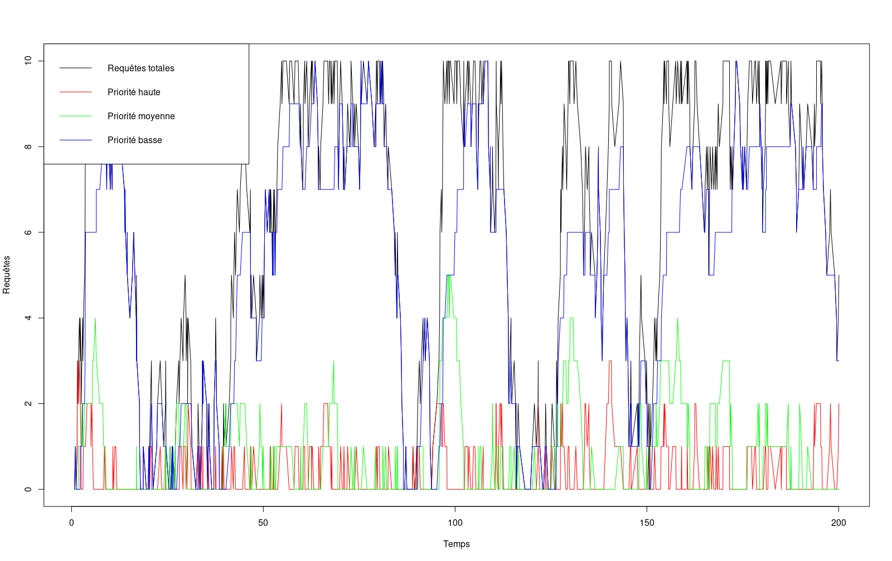

```{r setup, include=FALSE}
knitr::opts_chunk$set(echo = TRUE)
```

## Introduction

Le projet a été réalisé avec _R_. Plusieurs choix importants ont été effectué :

* Quel que soit l'état de la file, on traite toujours une requête prioritaire avant les autres, même si elle vient d'arriver.
* Une requête arrivant vers le(s) serveur(s) est rejetée dès lors que la limite de capacité est atteinte. Cela implique qu'on ne cherche pas à supprimer une requête de priorité faible pour faire de la place à une requête prioritaire arrivant sur le(s) serveur(s).
* S'il y a plusieurs serveurs, ceux-ci sont placés en parallèle.

## Résultats d'une petite simulation



La simulation a tourné pour les valeurs suivantes :

* $\lambda = 2$
* $\mu = 1,9$
* `duration` = $200$, de façon à permettre plus de lisibilité
* $1$ serveur
* Capacité de chaque serveur : $10$
* Probabilité pour chaque priorité (des plus prioritaires aux moins prioritaires) : `0.3 0.3 0.4`

Cette représentation graphique permet de constater que les requêtes prioritaires sont traitées avant les requêtes moins prioritaires, le service fonctionne correctement, cela se vérifie par les statistiques données en fin de traitement (si `stats = TRUE`) :

```
[1] "Moyenne des priorités hautes 0.391194968553459"
[1] "Moyenne des priorités moyennes 0.725786163522013"
[1] "Moyenne des priorités basses 4.99496855345912"
```


## Choix techniques

### Économie de mémoire et CPU pour les statistiques
Les tableaux permettant de générer les graphiques et les moyennes sont alloués statiquement en début de traitement grâce aux paramètres `lambda`, `mu` et `duration`. La concaténation de tableaux dans _R_ est en effet peu performante, puisque concaténer une valeur à un tableau implique que le moteur __recopie l'intégralité du tableau__ avant d'ajouter la nouvelle valeur. Pour des traitements longs, comme possible dans cette simulation, les chutes de performances sont énormes.

### Nombre de serveurs et capacité
Les valeurs `serverCount` et `serverCapacity` sont combinés en un seul indicateur, dans la fonction `effectiveCapacity`. Cela revient à dire que les deux situations suivantes sont équivalentes :

Valeurs | Deux serveurs, capacité k | Un serveur, capacité 2k
--------|---------------------------|------------------------
Capacité| k                         | 2k
Nombre de serveurs|2                | 1
Capacité effective|2*k = 2k         | 1*2k = 2k

Les deux valeurs sont modifiables indépendamment.

